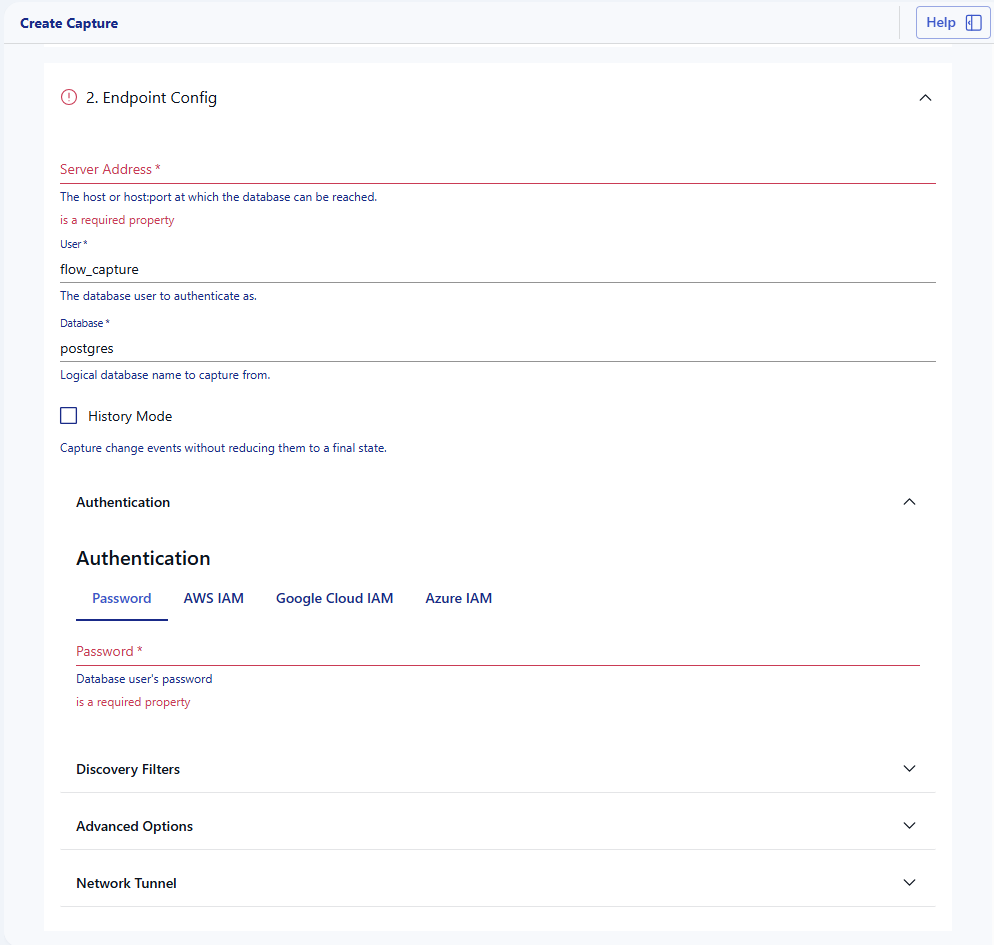
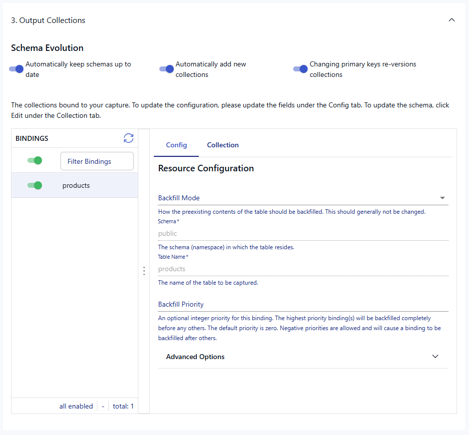
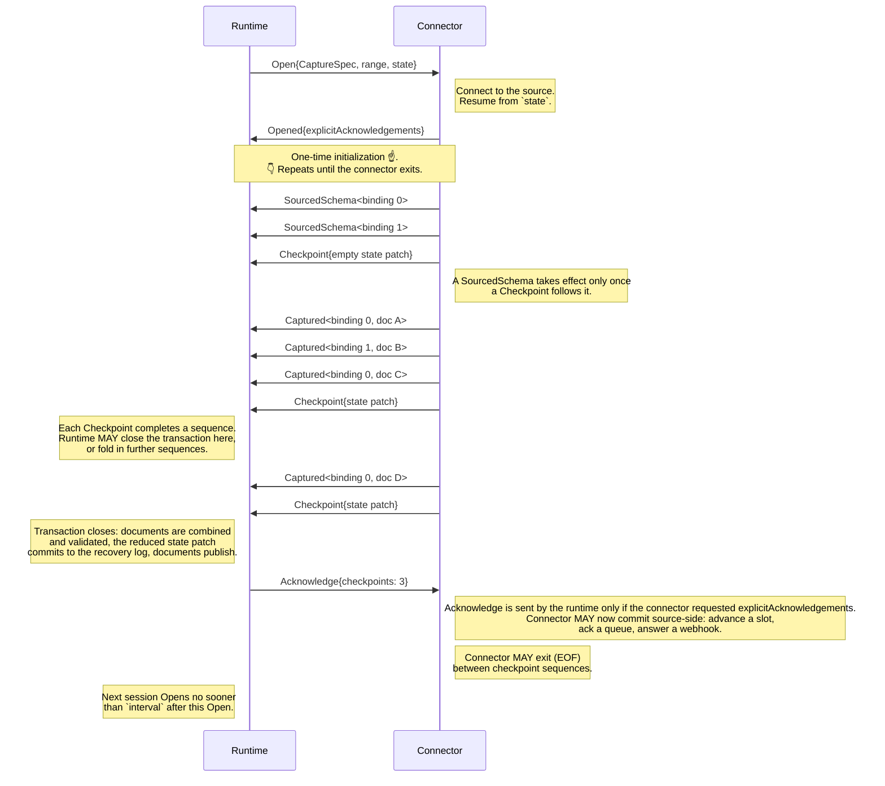

# Captures

Capture [connectors] read data from an external system, e.g. a database, a
SaaS API, an object store, or a message queue, and write it into Flow
[collections].
A capture is a long-lived RPC between the Flow runtime and a connector.
Over that RPC, the connector produces a stream of `Captured` documents and
`Checkpoint` messages, and the runtime maps the documents into collections
and commits them in transactions.

Captures are resumable.
As part of each checkpoint, the connector persists an arbitrary JSON state into
the runtime's transactional [recovery log][recovery-log], and it receives that
state back the next time it is started.
What the state means is entirely up to the connector.
Whether a capture is incremental (change data capture, or polling an API by
cursor) or a full refresh on every interval (periodic snapshots) depends on
what the source system offers, and the resumption semantics follow from that.

This document's aim is to explain in as much detail as possible the capture
protocol: how the Flow runtime (an overarching term for all the components
and pieces that drive Flow pipelines, including the data plane) interacts
with a capture connector, and the constraints and considerations necessary
when implementing one.
It describes the `runtime-next` runtime in the [flow] repo.
The previous runtime is being phased out and is not covered.

The actual protocol is defined as gRPC/protobuf [here][protobuf].
Here we will reference some of those message types denoted
with prefixes `Request.` and `Response.` and will explain their roles.
Two libraries connect the raw protocol to the connectors we actually write.
[source-boilerplate][boilerplate] is the Go library, and `sqlcapture` and
`filesource` are built on top of it.
[estuary-cdk][cdk] is the Python library.
This document references both.

# Request.Spec

`Request.Spec` is sent by the runtime to the connector, asking the connector
to describe itself: what configuration it expects, what the configuration of
a single resource looks like, where its documentation lives, and how OAuth2
is performed if the connector supports it.
The UI uses this information to render the connector configuration forms.
The connector responds with `Response.Spec`, which is roughly in this format:

```
{
  "protocol": 3032023, # magic number for the current protocol version
  "documentationUrl": "https://go.estuary.dev/hubspot-real-time",
  "configSchema": {
    "type": "object",
    "properties": {
      "credentials": {
        "title": "Authentication",
        "discriminator": {"propertyName": "credentials_title"},
        "oneOf": [
          {"$ref": "#/$defs/BaseOAuth2Credentials"},
          {"$ref": "#/$defs/AccessToken"}
        ]
      },
      ...
    }
  },
  "resourceConfigSchema": {
    "type": "object",
    "properties": {
      "name": {
        "type": "string"
      },
      "interval": {
        "type": "string"
      }
    },
    "required": ["name"]
  },
  "resourcePathPointers": ["/name"],
  "oauth2": {
    "provider": "hubspot",
    "authUrlTemplate": "https://app.hubspot.com/oauth/authorize?...",
    "accessTokenUrlTemplate": "...",
    "accessTokenBody": "...",
    "accessTokenResponseMap": { ... }
  }
}
```

`configSchema` is the JSONSchema describing the endpoint configuration,
e.g. the credentials for a SaaS API or the address of a database.
`resourceConfigSchema` describes the configuration of a single _resource_ to
be captured, usually a table, a stream, an API endpoint, or a file prefix.
See [config_schema_guidelines.md][config-guidelines] for how these schemas
should be annotated, and [docs/oauth.md][oauth] for the `oauth2` templates.

`protocol` must be `3032023`.
`flow-connector-init` rejects any other value before the response reaches the
runtime, and `configSchema`, `resourceConfigSchema` and `documentationUrl`
must all be non-empty.

`resourcePathPointers` is a list of JSON pointers into a resource
configuration which, when applied to it, yield the _resource path_ of the
binding: the components that uniquely identify the captured resource within
the endpoint.
For example, in `sqlcapture`'s resource config, `namespace` is the table's
schema and `stream` is its name, and the pointers are
`["/namespace", "/stream"]`.
A resource config of `{"namespace": "public", "stream": "users"}` therefore
has the resource path `["public", "users"]`.
The control plane matches discovered bindings against existing ones by their
resource path, and the pointers are how it computes a path for a resource
configuration that does not yet carry one (more on this under
[`Request.Discover`](#requestdiscover)).

A fresh instance of a connector is run in a new container to handle
`Request.Spec`, and it receives an empty `config` of `{}`.
The control plane sends `Request.Spec` when a connector image is published,
and the runtime sends its own `Request.Spec` with `{}` every time it starts
a connector container in order to learn the config schema.
`Response.Spec` therefore has to be answerable from static knowledge alone.
The connector should not parse the configuration, connect to anything, or
vary its schemas based on the configuration it was given.

For actual specifications of various connectors, look for `TestSpec` files
among the Go snapshots, or `snapshots__spec__stdout.json` among the Python
ones.

Endpoint config schema rendered in the UI:



Resource schema rendered in the UI:



# Request.Discover

`Request.Discover` is sent to the connector to ask which resources the
endpoint has to offer and how each of them should be captured.
Resources are the tables of a database, the object types of a SaaS API, and
so on.
The connector responds with `Response.Discovered`, which proposes one binding
per resource.
The control plane turns those proposals into a draft capture with a binding
per resource, and a draft collection per binding.

`Request.Discover` is sent in two situations:
1. A user creates or edits a capture in the UI, which runs a discovery to
  propose bindings.
2. The control plane runs a periodic discovery in the background for captures
  with `autoDiscover` enabled, by default every two hours, and publishes the
  capture again if anything changed.

A discovered binding for a Postgres table looks like this:

```
{
  "recommendedName": "public/users",
  "resourceConfig": {
    "namespace": "public",
    "stream": "users"
  },
  "documentSchema": {
    "$defs": {
      "PublicUsers": {
        "type": "object",
        "$anchor": "PublicUsers",
        "properties": {
          "id": {
            "type": "integer",
            "description": "(source type: non-nullable int4)"
          },
          "name": {
            "type": ["string", "null"],
            "description": "(source type: text)"
          }
        },
        "required": ["id"]
      }
    },
    ...
    "x-infer-schema": true
  },
  "key": ["/id"],
  "resourcePath": ["public", "users"]
}
```

`recommendedName` is the connector's suggestion for the name of the
collection.
The control plane normalizes it, prepends the capture's catalog prefix, and
uses the result as the collection name.
Discovered bindings are sorted by this name so that repeated discoveries
produce a stable ordering.

`resourceConfig` is the proposed configuration of the resource, following
`Response.Spec.resourceConfigSchema`, and `resourcePath` identifies the
resource within the endpoint.
The resource path is the identity of a binding.
When the control plane merges a discovery into an existing capture, it
matches each discovered binding to an existing one by resource path.
A matched binding is kept as it is, including its target collection, its
`disable` flag, its backfill counter, and any edits the user made to its
resource config.
An unmatched binding is new, and is added.
An existing binding whose resource was not discovered is removed from the
capture.
If `resourcePath` is not set, the control plane derives it from the resource
config using `Response.Spec.resourcePathPointers`.
Once a binding has been validated (see [`Request.Validate`](#requestvalidate)),
its resource path is also stored in its resource config under `/_meta/path`,
and that is preferred over the pointers from then on.

`documentSchema` is the JSON schema of the documents the binding will
produce.
The control plane installs it in the collection's schema as
`$defs["flow://connector-schema"]` and references it from there, so that a
later discovery can replace the connector's schema without disturbing
anything else in the collection.
When the schema is annotated with `x-infer-schema: true`, the collection
is created with the connector's schema as its `writeSchema` and a
`readSchema` of:

```
{
  "allOf": [
    {"$ref": "flow://relaxed-write-schema"},
    {"$ref": "flow://inferred-schema"}
  ]
}
```

An existing `readSchema` is never modified by discovery.
Only the connector's `$def` within the `writeSchema` is.

`key` is the proposed collection key as JSON pointers into the document,
and should reflect the natural identifier of the resource, e.g. the primary
key of a table.
`isFallbackKey` says whether the key is one the connector chose for lack of a
natural identifier, such as a file name and row offset.
The distinction decides who owns the collection key.
A regular key belongs to the connector: the connector will emit updates and
deletions against it, so on every discovery the control plane overwrites the
collection key with it.
A fallback key belongs to the user: the control plane uses it to create the
collection and then leaves the key alone, unless the key no longer resolves
in the discovered schema.
The rule of thumb is that a key the connector emits deletions for is not a
fallback.
When a discovery changes a collection's key and the capture has
`evolveIncompatibleCollections` enabled, the collection is reset and gets a
new generation (see [evolutions][evolutions]).

`disable` asks that the binding be added to the capture in a disabled state
for resources the connector expects most users will not want.
It applies only when the binding is first added.
Re-discovery never enables or disables an existing binding.

Discover should be free of side effects and reasonably cheap since it runs
in the background every couple of hours for the life of the capture.

A fresh instance of a connector is run in a new container to handle
`Request.Discover`.

For actual discovered bindings of various connectors, look for
`TestDiscovery` files among the Go snapshots, or
`snapshots__discover__stdout.json` among the Python ones.
See also the [discovery][captures-discovery] and [auto-discover][auto-discover]
sections of the public documentation.

# Request.Validate

Once a capture has been configured and its bindings chosen, the control
plane and the runtime validate the proposed specification before publishing
it.
The control plane asks the runtime to start a connector container, send it
`Request.Validate`, and return the result.

`Request.Validate` carries the endpoint `config` and the ordered list
of `bindings` to be captured.
Each binding carries its `resourceConfig`, the `collection` it is captured into,
and its `backfill` counter.
Only enabled bindings are included, so a binding the user has disabled is not
validated.
The request also carries `lastCapture` and `lastVersion`.
These describe the specification that was last published for this capture,
if any, and let the connector compare what is proposed against what is
currently running.
Note that the last published specification may not yet have been applied.

A binding looks like this in YAML:

```
bindings:
  - resource:
      _meta:
        path: ["public", "users"]
      namespace: public
      stream: users
      mode: Precise
    target: acmeCo/public/users
    backfill: 1
```

Here `resource` is the resource config, `target` is the collection, and
`backfill` is the backfill counter.
The `_meta.path` entry is the binding's resource path, stored into the
resource config by the control plane after a successful validation.

In this step the connector should confirm that it can connect to the
endpoint with the given configuration, and that each requested resource
exists and is readable with the permissions it has.
It should report every problem it finds rather than stopping at the first
so that a user configuring many bindings can fix them all at once.

The connector responds with `Response.Validated`, which has one entry per
binding of the request, in the same order.
Each entry carries the binding's `resourcePath`.
It is required, and must be unique across the response.
The path the connector returns here is authoritative: the control plane
stores it into the binding's resource config as `_meta.path`, replacing
whatever was there, and it is what identifies the binding from then on in
discovery, in the connector state, and across edits of the capture.

The backfill counter is the mechanism by which a binding is backfilled.
Every binding has a `backfill` counter, starting at zero.
The control plane derives a _state key_ for each binding from its resource
path and its backfill counter: the path components are joined with `/`,
characters other than letters, numbers and `-_+.=` are percent-encoded, and
`.v<N>` is appended when the counter is non-zero.
The binding above has the state key `public%2Fusers.v1`.
The connector receives the state key with each binding in `Request.Open` and
is expected to key its per-binding state by it (more on this under
[`Request.Open`](#requestopen)).
Incrementing the counter therefore gives the binding a new state key with no
state stored under it, and the connector starts that binding over from
scratch at the next `Request.Open`.

A fresh instance of a connector is run in a new container to handle
`Request.Validate`.

# Request.Apply

After a specification has been validated and published, and before a
capture session begins, the runtime sends the connector `Request.Apply`.
Apply is the connector's opportunity to set up or alter anything in the
source system that the specification requires, e.g. to create a subscription
per binding in a message broker.
For most capture connectors there is nothing to do, and Apply is a no-op.

`Request.Apply` carries the `capture` specification being applied and its
`version`, along with `lastCapture` and `lastVersion` describing the
specification that was last applied successfully, if any.
The connector responds with `Response.Applied`.
Its `actionDescription` is a human-readable summary of what the connector
did, which the runtime logs.
An empty description means the Apply was a no-op.

The runtime sends `Request.Apply` at the start of a session, after
recovering its state and before `Request.Open`.
The next session does not open until the preceding Apply has completed and
its result has been durably recorded.

Apply must be idempotent.
The runtime may send it again for the same `version` and `lastVersion` even
after a call that succeeded from the connector's point of view, e.g. if the
shard restarted before the result was recorded.
A connector should therefore treat Apply as "make the source look like this
specification" rather than "perform these actions once".

A fresh instance of a connector is run in a new container to handle
`Request.Apply`.

# Request.Open

With the specification applied, the actual capture of data can begin.
The runtime starts an instance of the connector in a new container and sends
it `Request.Open`, which begins a capture _session_.
Unless the connector asks for acknowledgements (see
[`Request.Acknowledge`](#requestacknowledge)), `Request.Open` is also the last
message the connector will receive.
From this point the connector sends and the runtime listens until the
connector exits or the runtime stops it.

`Request.Open.capture` is the full specification of the capture.
It carries the endpoint `config`, the list of enabled `bindings`, and a
handful of task-level settings.
Each binding carries its `resourceConfig`, its `resourcePath`, the
`collection` it is captured into, its `backfill` counter, and its `stateKey`.
`Captured` documents refer to bindings by their index in this list.
Disabled bindings are not present, so the indices shift when a user disables
or re-enables a binding.
The stable identity of a binding is its resource path and state key, not
its index.

`Request.Open.capture.intervalSeconds` is the capture's `interval` setting.
When the connector exits cleanly, the runtime starts a new session, but no
sooner than this long after the previous one was opened (more on this under
[`Response.Checkpoint`](#responsecheckpoint)).
`networkPorts` lists the ports the connector's container exposes, if any
(see [inbound networking][inbound-networking]).

`Request.Open.state` is the fully reduced connector state as of the last
committed transaction, or `{}` for a new capture.
How it is reduced is explained under [Connector state](#connector-state).

`Request.Open.range` is the range of keys this instance of the connector is
responsible for, explained under [Key ranges](#key-ranges) below.

The connector responds with `Response.Opened`.
Its one field, `explicitAcknowledgements`, is the connector's choice of
whether it wants to be told when its checkpoints have committed (see
[`Request.Acknowledge`](#requestacknowledge)).
The connector then stays running, and produces the stream of messages shown
in the sequence diagram below.

## Key ranges

`Request.Open.range` gives a `keyBegin` and `keyEnd`, an inclusive range of
32-bit keys that this instance of the connector is responsible for.
A capture task can in principle be split into several shards, each running
its own instance of the connector over a sub-range, so that a large source
can be captured in parallel.
Today, captures run as a single shard covering the full range.
Support for splitting captures is planned future work in the runtime, and
`range` is what the protocol already provides for it.

## Sequence Diagram

As a convention and to reduce ambiguity, requests (runtime to connector) are
named as commands and responses (connector to runtime) as completed actions:
`Open` asks, and `Opened` answers.



The full cycle is:
`Request.Open` -> `Response.Opened` -> `Response.Captured`... ->
`Response.Checkpoint` -> (loop back) `Response.Captured`...

`Response.SourcedSchema` may be sent anywhere `Response.Captured` may, and
`Request.Acknowledge` follows each commit when the connector has asked for
it.
When the connector exits between checkpoints, the cycle starts over from
`Request.Open` after `interval`.

## Response.Captured

`Response.Captured` carries one document captured from the source.
`binding` is the index of the binding in `Request.Open.capture.bindings`
that the document belongs to, and `doc` is the JSON document itself.
A captured document is _pending_: it is not committed to its collection
until the connector sends a `Response.Checkpoint`.
If the connector exits or fails before then, the document is discarded and
is expected to be captured again by the next session.

The runtime processes each document as it arrives.
It checks that `binding` is in range, parses `doc`, and adds it to a
_combiner_ for the target collection.
The combiner groups documents by the collection key, and reduces documents
that share a key according to the `reduce` annotations of the collection's
write schema.
When the transaction closes, the combined documents are validated against
the write schema and published to the collection, with the collection key
and any logical partition fields extracted from each one.
Every document must therefore contain the collection's key fields.
A document that fails validation fails the capture.
The connector must not emit a document that does not conform to the schema
it declared for the binding.

The runtime does not otherwise alter the document, with one exception.
Every collection reserves a location for a document UUID, `/_meta/uuid` by
default, and the runtime overwrites whatever the connector put there with a
UUID assigned when the document is published.
A connector should leave that location alone.

A single `Response.Captured` message may be at most 64 MB.
This is the runtime's `MAX_MESSAGE_SIZE` for decoding connector responses
([lib.rs][max-message-size]), and it bounds the size of a document.
Most documents are much smaller than this though.
There is no limit on how many documents may be sent before a checkpoint, but
the runtime holds all of them pending until the checkpoint arrives, and it
does bound how many bytes one checkpoint sequence may contain.
Once a sequence exceeds 512 MB of captured documents, the runtime
injects a _synthetic checkpoint_ and logs a warning.
The transaction then commits without advancing the connector's state, so a
failure afterwards would replay those documents, and delivery degrades to
at-least-once.
Connectors should strive to checkpoint often enough that a synthetic
checkpoint is never inserted.

### Document Shape Conventions

Documents produced by our connectors share a `_meta` object, documented for
users in the [metadata fields guide][metadata-fields].
`_meta/op` is the operation type: `"c"` for a create, `"u"` for an update,
and `"d"` for a deletion.
A deletion is an ordinary `Response.Captured` whose document has
`_meta/op: "d"` and contains at least the collection key.
The runtime itself attaches no meaning to `_meta/op`.
Deletions are a convention that materializations and other consumers act on
(see the [deletions guide][deletions]), which is why a deletion must share
its collection key with the document it deletes.

## Response.Checkpoint

`Response.Checkpoint` marks a point in the stream of captured documents at
which the runtime may commit.
It says two things: every `Response.Captured` sent since the previous
checkpoint is complete, and the connector state carried by the checkpoint is
sufficient to resume from this point.
The documents since the last checkpoint and the checkpoint itself form a
_checkpoint sequence_.

When the runtime commits a transaction, the documents of the transaction are
published to their collections and the connector state is written to the
recovery log atomically.

Whether a given checkpoint becomes a transaction boundary is the runtime's
decision.
The runtime closes transactions on its own cadence, and a transaction
contains however many checkpoint sequences completed while it was open.
Checkpointing often is therefore cheap: a checkpoint does not force a
commit, and the runtime folds many small checkpoints into one transaction.
The opposite hurts: one checkpoint sequence that grows very large holds
every document in it pending until the sequence ends (see the synthetic
checkpoint under [`Response.Captured`](#responsecaptured)).

Many connectors run continuously, tailing their source for as long as the
session lasts, and exit only when they fail or the runtime stops them.
Connectors for sources that cannot be tailed instead capture what is
currently available, checkpoint, and exit.
An exit between checkpoint sequences is a clean end of the session, and the
runtime starts a new one no sooner than `interval` after the previous
session was opened.
Exiting in the middle of a checkpoint sequence is an error: the runtime
discards the pending documents and fails the session.

### Connector state

`Response.Checkpoint.state` is the connector state update.
It has two fields.
`updated` is a JSON object, and `mergePatch` says how to combine it with the
state that came before.
A checkpoint for the binding validated above looks like this:

```
{
  "checkpoint": {
    "state": {
      "updated": {
        "bindingStateV1": {
          "public%2Fusers.v1": {
            "mode": "Active",
            "scanned": null
          }
        },
        "cursor": "0/1A2B4000"
      },
      "mergePatch": true
    }
  }
}
```

With `mergePatch: true`, `updated` is applied to the previous state as an
[RFC 7396][rfc7396] JSON merge patch.
Objects are merged recursively, a `null` value deletes the key it is
assigned to, and any other value replaces what was there.
Suppose the previous state was:

```
{
  "bindingStateV1": {
    "public%2Fusers.v1": {
      "mode": "Backfill",
      "key_columns": ["id"],
      "scanned": "AQID",
      "backfilled": 1200
    },
    "public%2Forders": {
      "mode": "Active",
      "key_columns": ["id"]
    }
  },
  "cursor": "0/1A2B3C4D"
}
```

Applying the patch above yields:

```
{
  "bindingStateV1": {
    "public%2Fusers.v1": {
      "mode": "Active",
      "key_columns": ["id"],
      "backfilled": 1200
    },
    "public%2Forders": {
      "mode": "Active",
      "key_columns": ["id"]
    }
  },
  "cursor": "0/1A2B4000"
}
```

With `mergePatch: false`, `updated` replaces the previous state entirely.
The runtime keeps only the reduced result of all the patches it has
committed, and that is what `Request.Open.state` carries.

The shape of the state is entirely up to the connector, but our connectors
share a convention.
Per-binding state lives under `bindingStateV1`, keyed by each binding's
`stateKey`, and anything shared across bindings lives at the top level, like
the replication `cursor` above.
Keying by `stateKey` is what makes backfills work: when a user increments a
binding's backfill counter, its state key changes, the connector finds no
entry for it, and it starts the binding from the beginning.
Connectors that capture bindings concurrently should checkpoint patches that
mention only the bindings that changed so that one binding's progress never
overwrites another's.

What the state must capture is a _resume point_: a description of where the
connector left off from which the next session can continue without
missing documents.
Two rules follow.
1. A cursor must never run ahead of the documents actually sent. Send the
  documents of a page or a batch first, then checkpoint the cursor that
  follows them.
2. The position must be one the source cannot shift underneath the
  connector.
  A numeric offset into a list is not, since deletions renumber the list.
  The largest id captured so far is.

## Request.Acknowledge

`Request.Acknowledge` is sent by the runtime to tell the connector that some
number of its checkpoints have committed to the recovery log.
It is only sent if the connector set
`Response.Opened.explicitAcknowledgements`.

The message carries a count named `checkpoints`.
It means that the runtime has durably committed the next N of the
connector's not-yet-acknowledged checkpoints in the order they were
emitted.
A connector that cares therefore keeps a queue of whatever it needs to
remember per checkpoint and pops N entries on each acknowledgement.

The acknowledgement is sent once the transaction's commit to the recovery
log is durable and before the transaction's documents become readable by
downstream tasks.

> [!NOTE]
> The reason to ask for acknowledgements is to perform some source-side commit
> only once Flow has durably captured the data.
> For Postgres this is advancing the replication slot so the database can
> reclaim WAL.
> For Pub/Sub and SQS it is acking or deleting the message.
> For a webhook receiver it is answering the HTTP request so the sender does
> not see a 200 until Flow has committed the document.
> In each case the source-side commit is what stops the source from delivering
> the data again, so it has to wait for the acknowledgement rather than follow
> the checkpoint directly.

A connector that asks for acknowledgements must keep reading the request stream.
The runtime does not proceed past an acknowledgement until the connector has
consumed it, so a connector that stops reading requests stalls every further
commit.
Acknowledgements also never span sessions.
If a session ends before an acknowledgement is delivered, the next session
does not receive it, and whatever source-side commit it would have
triggered does not happen.
A connector has to tolerate this, e.g. by expecting a queue to deliver a
message a second time.

## Response.SourcedSchema

`Response.SourcedSchema` widens a collection's inferred schema with what the
source system says the documents of a binding look like, without waiting for
documents to be captured and inferred from.

The message carries the `binding` index and a `documentSchema`.
The schema may be partial, describing some fields and not others, and it
need not have changed since the last one sent.
A sourced schema for the `users` binding looks like this:

```
{
  "sourcedSchema": {
    "binding": 0,
    "documentSchema": {
      "type": "object",
      "additionalProperties": false,
      "properties": {
        "id": {"type": "integer"},
        "name": {"type": "string"},
        "_meta": {
          "type": "object",
          "additionalProperties": false,
          "properties": {
            "op": {"type": "string", "enum": ["c", "u", "d"]},
            ...
          },
          "required": ["op"]
        }
      },
      "required": ["id", "name", "_meta"]
    }
  }
}
```

`Response.SourcedSchema` is transactional.
It may be interleaved with `Response.Captured` documents, and several may be
sent for one binding, but none of them has any effect until a
`Response.Checkpoint` follows.

The runtime unions sourced schemas into the collection's _inferred schema_,
alongside what it infers from the documents themselves.
It never edits a collection's `writeSchema` or `readSchema` directly, so a
sourced schema has an effect only on collections whose read schema
references `flow://inferred-schema` (see
[`Request.Discover`](#requestdiscover)).
The inferred schema only ever widens: everything unioned into it stays, and
nothing a later sourced schema says can narrow it again.

### Sourced Schema guidelines

1. Send sourced schemas liberally.
   Send one for every binding on startup, and again whenever the connector
   notices a field it has not seen before.
2. Send them before documents.
   At the start of a session, emit the sourced schemas and then a checkpoint
   before the first `Response.Captured`, so that the schema is committed
   before any document that relies on it.
   For a newly added binding this gives the collection a useful
   inferred schema before any documents exist, so materializations see its
   columns at once rather than after the first documents arrive.
3. Be maximally restrictive.
   Allow only the types being explicitly described, and set
   `additionalProperties: false` on every object that declares
   `properties`.
   The runtime rejects a sourced schema that leaves an object open and fails
   the session.
4. Mark every property that is always present as `required`.
   A property the sourced schema lists without requiring becomes optional in
   the inferred schema, even if every document contains it.
5. Cover every field the connector emits, `_meta` included.
   Any fields omitted from a sourced schema become optional in the inferred
   schema.

# Delivery guarantees and resumption patterns

The connector must decide what to put in a checkpoint so that a session
can resume without missing or repeating data.
How that is done depends almost entirely on what the source system offers,
and a handful of patterns cover many of the connectors we have written.
Before the patterns, it is worth being precise about what the runtime does
and does not guarantee.

The runtime guarantees that documents and connector state commit together,
and that only one instance of a capture can commit at a time.
Documents are published to collections only by the runtime, and only after
the transaction has committed to the recovery log.
The recovery log is fenced, so if a duplicate _zombie_ instance of the
connector is still running when a new one starts, the zombie's transactions
are rejected at the Gazette recovery log level, its documents are never
published, and it never receives an acknowledgement.
Captures need no fencing of their own.
Where a zombie can still cause trouble is at the source.
For example, two instances tailing the same Postgres replication slot will
collide.
The database refuses the second with an error saying the slot is active for
another process.
Anything a connector does to the source outside of a transaction, such as
setup in `Request.Apply`, has to be idempotent for the same reason.

What the runtime does not guarantee is that the connector's state describes
a precise resume point.
When the source offers a precise resume point such as a log position or a
stable cursor, and the state records it, the capture is exactly-once.
When it does not, the capture is at-least-once: after a failure, some
documents are captured a second time.
Whether that duplication matters depends on the collection's reduction.
Collections are keyed, and documents sharing a key are reduced.
The default last-write-wins [reduction strategy][reduction-strategies], and
the `merge` strategy that our discovered schemas commonly annotate, are
idempotent: reducing a document with a copy of itself yields the same
document.
Reductions such as `sum` and `append` are not idempotent, since reducing a
duplicate changes the result, so collections using them need an exactly-once
source.

### Change Data Capture

Database connectors tail the database's replication log, and the position
in that log is the resume point.
The position is shared by every binding, since one replication stream
serves them all, and while the connector is streaming every database
transaction commit becomes a checkpoint.
Because the position is exact, change data capture is exactly-once.
The connector asks for acknowledgements and uses them to advance the
database's replication slot, so the database never discards logs that the
capture has not committed.
A newly added table is backfilled in chunks while changes for the other
tables keep arriving, and each chunk commits in the same transaction as the
changes that arrived alongside it.

### Polling an API

SaaS APIs rarely offer a change log, so connectors poll them.
They list records modified since a cursor, emit them, and checkpoint the new
cursor.
Historical records are backfilled page by page alongside the incremental
polling, with the point at which polling began marking where the backfill
can stop.
Resources that cannot be captured incrementally are captured as periodic
snapshots, emitted only when their content changes.
Whether polling is exactly-once comes down to whether the API's cursor is a
precise resume point.
A modification-time cursor with server-side filtering usually is, provided
the connector leaves a margin for records that are not yet visible to a
listing.

### Sweeping Files

Object stores have no change log at all.
File connectors sweep a prefix of a bucket.
They list every object under it in a stable order and read each one that is
new since the last sweep.
Within a sweep the resume point is the last file completed, and across
sweeps it is a modification-time bound, set a little behind the present to
allow for clock skew between the store and the connector.
Documents are keyed by file and record offset since files carry no
identifier of their own.
Each sweep ends with the connector exiting, and the runtime starts the next
one after `interval`.

### Push Endpoints

The connector is a server, the container exposes a port (see
[inbound networking][inbound-networking]), and the source pushes data to it.
There is nothing to resume, and the connector's checkpoints carry no state.
What the connector needs instead is to know when a request's documents have
committed, so it asks for acknowledgements and withholds the HTTP response
until the acknowledgement arrives.
A sender that does not receive a 200 should retry, so the capture is
at-least-once by construction.

### Queues

Message queues such as SQS and Pub/Sub are similar, with the connector
pulling instead of the source pushing.
The queue itself is the state.
The connector emits the messages it receives, checkpoints, and deletes or
acks them at the queue only once the checkpoint is acknowledged.
A message whose acknowledgement never arrives is redelivered by the queue,
so delivery is at-least-once.

# Side channels: logs, status and config updates

Everything a connector writes to stderr is collected as a log.
The runtime reads stderr line by line, and each line that parses as a JSON
object becomes a structured log entry with a timestamp, a level, a message,
and a map of additional fields.
Entries at the task's configured log level or a more severe one are written
to the tenant's `ops` logs collection, described in the public documentation
on [logs and statistics][logs-stats].
Statistics are produced by the runtime from the documents it processes, and
connectors do not emit them.

A log entry becomes an _event_ when its `fields` carry an `eventType`.
Connectors may emit two kinds.

```
{
  "level": "info",
  "message": "Streaming change events (all 12 bindings are backfilled)",
  "fields": {
    "eventType": "connectorStatus"
  }
}
```

A `connectorStatus` event is a human-readable statement of what the
connector is currently doing.
The control plane keeps the most recent one per task and shows it to users
alongside the task's other status. It is how a connector reports
progress such as how many bindings are still backfilling.
A status is considered current only if it was written by the running build
of the task after its last activation. A connector should emit one early
in each session and again whenever the situation changes.

```
{
  "level": "info",
  "message": "Rotated the OAuth2 refresh token",
  "fields": {
    "eventType": "configUpdate",
    "config": {
      "credentials": {
        "refresh_token": "ENC[AES256_GCM,data:...]",
        ...
      },
      "sops": { ... }
    }
  }
}
```

A `configUpdate` event asks the control plane to replace the capture's
endpoint config.
`fields.config` is the complete new config, not a patch, and the control
plane publishes a new version of the capture with it as the endpoint config.
The current use case is a source whose credentials change underneath the
connector, most commonly an OAuth2 provider that issues a new refresh token
on every refresh and invalidates the old one, so that the config the capture
was published with stops working.
Because the config is published as-is, it must be encrypted the way the
control plane encrypts every endpoint config.

# Testing

Capture connectors are tested through the protocol they speak rather than
through their internals.
For example, the Go test harness in `source-boilerplate` sends a connector
`Request.Open` in-process and records exactly what the runtime would have
seen, and the Python tests run the connector under `flowctl raw spec`,
`flowctl raw discover` and `flowctl raw preview-next`.
Spec and Discover responses are snapshotted alongside captured documents.

Tests run against real endpoints rather than mocks: real databases in
containers, and real cloud services and SaaS APIs with encrypted
credentials.

What tests exercise most is transactions and resumption.
See [tests/README.md][tests-readme] for how the integration tests are laid
out.

# Addendum: exercising the protocol with flowctl

The requests above can be sent to a connector by hand with `flowctl`, which
is how connectors are developed and tested locally.

- `flowctl raw spec` sends `Request.Spec` and prints the response.
- `flowctl raw discover` sends `Request.Discover` and writes the discovered
  bindings and collections into catalog files.
- `flowctl raw oauth` exercises the `oauth2` section of `Response.Spec`
  against the provider.
- `flowctl raw preview-next` validates the catalog, which sends
  `Request.Validate`, and then runs the capture locally, which sends
  `Request.Apply` and `Request.Open` and drives the session that follows.

# References

- The capture protocol: [capture.proto][protobuf], and the messages it
  shares with the rest of Flow in [flow.proto][flow-proto].
- The runtime: [crates/runtime-next][runtime-next] in the flow repo, whose
  README describes the transaction loop.
- The libraries: [source-boilerplate][boilerplate], [sqlcapture][sqlcapture],
  [filesource][filesource], and [estuary-cdk][cdk-readme].
- Development guidelines: [config_schema_guidelines.md][config-guidelines],
  [docs/oauth.md][oauth], [docs/inbound_networking.md][inbound-networking],
  and [docs/feature_flags.md][feature-flags].
- Public documentation: [captures][captures-concept],
  [schema evolution][evolutions], [logs and statistics][logs-stats],
  [reduction strategies][reduction-strategies], and
  [deletions][deletions].

[connectors]: https://docs.estuary.dev/concepts/connectors/
[collections]: https://docs.estuary.dev/concepts/collections/
[protobuf]: https://github.com/estuary/flow/blob/master/go/protocols/capture/capture.proto
[boilerplate]: ../../source-boilerplate
[cdk]: ../../estuary-cdk
[recovery-log]: https://gazette.readthedocs.io/en/latest/consumers-concepts.html#recovery-logs
[flow]: https://github.com/estuary/flow
[config-guidelines]: ../../config_schema_guidelines.md
[oauth]: ../oauth.md
[captures-discovery]: https://docs.estuary.dev/concepts/captures/#discovery
[auto-discover]: https://docs.estuary.dev/concepts/captures/#automatically-update-captures
[evolutions]: https://docs.estuary.dev/concepts/advanced/evolutions/
[inbound-networking]: ../inbound_networking.md
[metadata-fields]: https://docs.estuary.dev/guides/advanced-usage/metadata-fields/
[deletions]: https://docs.estuary.dev/reference/deletions/
[max-message-size]: https://github.com/estuary/flow/blob/master/crates/runtime-next/src/lib.rs
[rfc7396]: https://www.rfc-editor.org/rfc/rfc7396
[reduction-strategies]: https://docs.estuary.dev/reference/reduction-strategies/
[cdk-readme]: ../../estuary-cdk/README.md
[logs-stats]: https://docs.estuary.dev/concepts/advanced/logs-stats/
[tests-readme]: ../../tests/README.md
[flow-proto]: https://github.com/estuary/flow/blob/master/go/protocols/flow/flow.proto
[runtime-next]: https://github.com/estuary/flow/tree/master/crates/runtime-next
[sqlcapture]: ../../sqlcapture
[filesource]: ../../filesource
[feature-flags]: ../feature_flags.md
[captures-concept]: https://docs.estuary.dev/concepts/captures/
