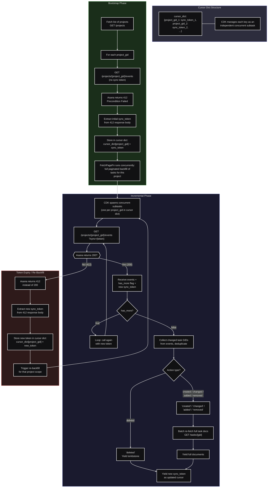

# Asana Source Connector

An Estuary Flow source connector for Asana.

## Captured Resources

| Resource         | Type        | Scope         | Description                            |
| ---------------- | ----------- | ------------- | -------------------------------------- |
| Workspaces       | Snapshot    | Global        | All workspaces                         |
| Users            | Snapshot    | Per-workspace | Deduplicated across workspaces         |
| Teams            | Snapshot    | Per-workspace | Organization workspaces only           |
| Projects         | Snapshot    | Per-workspace | Active (non-archived) projects         |
| Tasks            | Incremental | Per-project   | Sync-token events + backfill           |
| Sections         | Snapshot    | Per-project   | Project sections                       |
| Tags             | Snapshot    | Per-workspace | All tags                               |
| Portfolios       | Snapshot    | Per-workspace | Portfolios owned by authenticated user |
| Goals            | Snapshot    | Per-workspace | All goals                              |
| CustomFields     | Snapshot    | Per-workspace | Custom field definitions               |
| TimePeriods      | Snapshot    | Per-workspace | Time period definitions                |
| ProjectTemplates | Snapshot    | Per-workspace | Project templates                      |
| StatusUpdates    | Snapshot    | Per-project   | Project status updates                 |
| Attachments      | Snapshot    | Per-project   | Project attachments                    |
| Stories          | Snapshot    | Per-task      | Task comments and activity             |
| Memberships      | Snapshot    | Per-project   | Project memberships                    |
| TeamMemberships  | Snapshot    | Per-team      | Team memberships                       |

## Setup

### Prerequisites

- Python 3.12+
- Poetry
- flowctl (`brew install estuary/tap/flowctl`)

### Installation

1. **Install dependencies:**

   ```bash
   poetry install
   ```

2. **Configure credentials:**
   ```bash
   # Edit config.yaml with your Asana personal access token (gitignored)
   ```

## Development

### Run tests

```bash
# Unit tests (no credentials needed)
poetry run pytest tests/test_connector.py -v

# API connectivity tests (requires config.yaml)
poetry run pytest tests/test_api.py -v

# All tests
poetry run pytest -v
```

### Test with flowctl

```bash
# Test spec output
flowctl raw spec --source test.flow.yaml

# Test discover
flowctl raw discover --source test.flow.yaml -o json --emit-raw

# Preview capture
flowctl preview --source test.flow.yaml --sessions 1 --delay 15s
```

## Design Documentation


