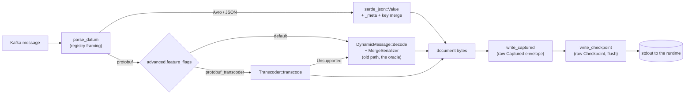
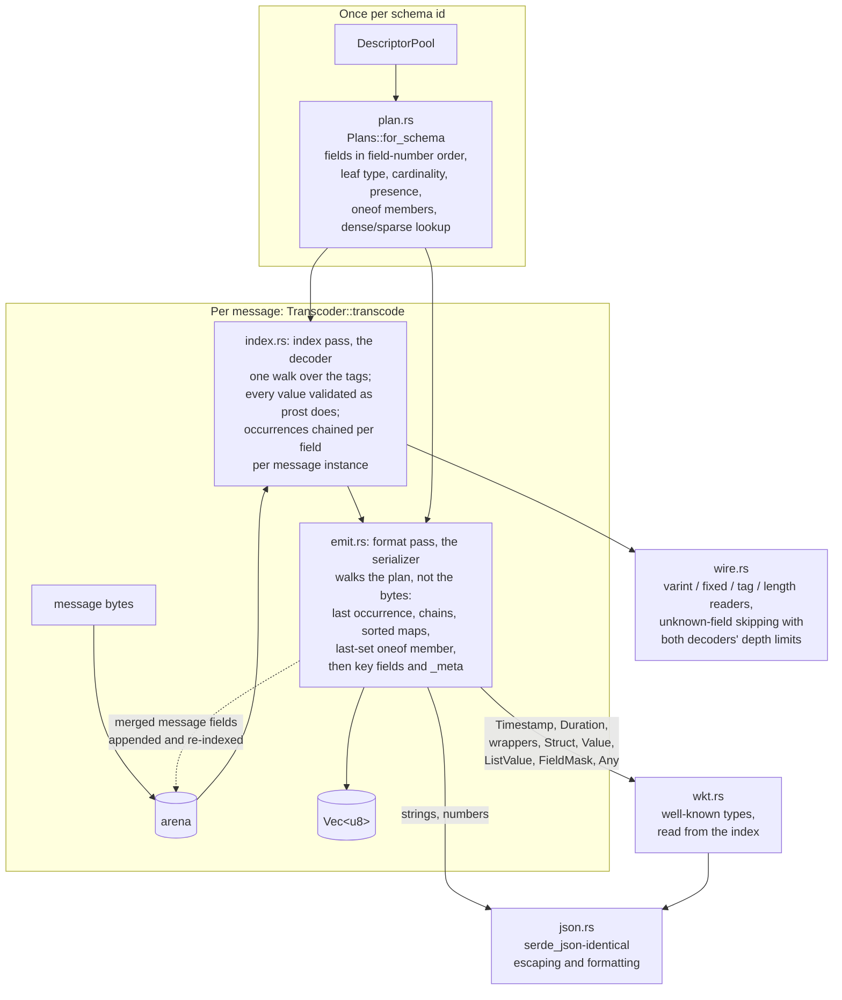

# source-kafka protobuf transcoder

This doc explains why `source-kafka` has its own protobuf-wire-to-JSON
transcoder, how the pieces in `src/transcode/` fit together, and the design
decisions we made along the way so they don't get accidentally undone later.
See [README.md](README.md) for the connector overview and
`benches/protobuf_path.rs` for the measurements behind the numbers here.

## Problem

A `source-kafka` capture runs on a single task shard, and that shard is CPU
bound. Kafka I/O isn't the bottleneck: `librdkafka` does the socket reads and
decompression on its own threads, and in a June 2026 profile of a saturated
capture those threads were ~0.5% of samples. Everything else happens on one
tokio worker, per message, and for registry protobuf payloads most of that work
was decoding the message into a `prost_reflect::DynamicMessage` and
serializing it back out:

1. `DynamicMessage::decode` builds a tree: a `BTreeMap` per message, a heap
   `Value` per field, a descriptor lookup per tag, and a `clear_oneof_fields`
   scan every time a oneof member is written.
2. `serialize_with_options` walks that tree again through serde, looking up
   each field's descriptor a second time to get its name and kind.
3. `MergeSerializer` streams the result into bytes with the message key and
   `_meta` merged in.

Here's what that costs per message on a WSL2 dev box with jemalloc linked
like production (`cargo bench --bench protobuf_path`, ns):

| shape | wire bytes | total | resolve + decode + serialize | share |
|---|--:|--:|--:|--:|
| tiny | 20 | 2,740 | 1,214 | 44% |
| event | 205 | 6,861 | 5,110 | 74% |
| wide | 238 | 9,276 | 7,282 | 79% |
| text | 2,205 | 4,172 | 2,191 | 53% |
| nested | 280 | 9,392 | 7,134 | 76% |

So for a typical event-shaped message, three quarters of the CPU we spend per
message is the `DynamicMessage` round trip.

## What we tried first

- **Trimming around `DynamicMessage`.** We did this in June 2026: #4732
  removed a serialize-then-reparse round trip and #4734 removed the
  intermediate `serde_json::Value`. Each was worth 10–15%. What's left is the
  tree itself, and there's no way to make that cheap without replacing the
  decoder.
- **upb**, Google's C protobuf runtime, over FFI. I benchmarked it in July
  2026. Its arena decoder is 3–5x faster than `DynamicMessage`, but its JSON
  encoder is up to 3.5x *slower* than serde_json on strings. On text-heavy
  messages the whole path came out a wash or a regression, so we dropped it.
- **Generating code per schema.** This would be the fastest option, but
  schemas come from the schema registry at runtime and there's no compile
  step, so it's not actually available to us.

That left writing a transcoder that reads protobuf tags straight off the wire
and writes JSON, using a plan for the message type that we resolve once instead
of per field per message. The stages it replaces got 1.4x (text) to 2.9x (wide)
faster, which is 1.2x to 2.1x on the whole per-message path, and 1.6x to 2.7x
once the `Response` envelope is also written as raw bytes:

| shape | transcode ns | transcoder alone | + raw envelopes | ceiling |
|---|--:|--:|--:|--:|
| tiny | 646 | 1.25x | 1.72x | 1.77x |
| event | 2,071 | 1.83x | 2.31x | 3.99x |
| wide | 2,630 | 2.11x | 2.71x | 4.93x |
| text | 1,502 | 1.19x | 1.59x | 2.17x |
| nested | 2,931 | 1.96x | 2.52x | 4.81x |

The ceiling column is the speedup we'd get if resolve, decode, and serialize
cost nothing at all, so it bounds what any replacement for those stages can
reach. The gap between it and what we got is string escaping, UTF-8
validation, number formatting, and bookkeeping, which any implementation has
to pay for.

## The contract

The transcoder is a performance change, not a behavior change. The old path
(`DynamicMessage::decode` + `MergeSerializer`) is still in the tree as
`dynamic_protobuf_document` in `src/pull.rs`, and it's the oracle every test
compares against. Specifically:

- For any message without a protobuf map field, the output is byte-identical
  to the old path.
- For messages with maps, the output parses to the same document. The old
  path emits map entries in `HashMap` order; the transcoder sorts them by key,
  which also makes its output deterministic. The runtime sorts object keys
  anyway, so nothing downstream can tell.
- There's exactly one value-level difference: a
  `FloatValue` or `DoubleValue` wrapper holding `-0.0` prints `-0.0`. The old
  path prints `0.0` because it serializes wrappers by re-encoding them, and
  `-0.0` gets dropped as a default on the way through. The transcoder's output
  is what protobuf's reference JSON printer emits, and both parse to the same
  f64, so we kept the correct behavior and pinned it with a test.
- Malformed input fails on both paths or on neither, including the places
  where prost-reflect is more lenient than the spec (more on that below).
- Anything the transcoder doesn't implement returns
  `TranscodeError::Unsupported` and the caller runs the old path for that one
  message. Today that's proto2 groups, messages with registered extensions,
  and a well-known type as the whole payload. Everything protobuf's merge
  rules allow (a singular message field or a map entry that appears more than
  once, a oneof member set twice) is handled, because hand-built or
  concatenated messages are legal and have to come out right.

## Where it sits in the pull loop

`parse_datum` hands protobuf payloads to `do_pull` as wire bytes
(`Parsed::Protobuf`) rather than decoding them, because the document can't be
written until the message key and `_meta` are known. Keys and tombstones take
the same paths they always did.

The `Captured` and `Checkpoint` lines are written as raw bytes
(`write_captured` in `src/lib.rs`, `write_checkpoint` in `src/pull.rs`)
instead of through `Response` serialization, which re-parsed every document as
a `RawValue` just to validate it. That's independent of the transcoder and
helps every payload type. The runtime still parses every line, so malformed
output would fail loudly rather than silently; the byte-identity and
round-trip tests carry the confidence the validation used to.

## How the transcoder works

**Plans are compiled once.** `plan.rs` turns a `DescriptorPool` into a
`MessagePlan` per message type: its fields in ascending field-number order
(the order `DynamicMessage` serializes in), each with its leaf type (a scalar,
an enum, or the `PlanId` of a nested message), its cardinality (singular with a
presence rule, repeated, or a map with key and value leaves), which oneof it
belongs to, and whether it's a group. A `Lookup` maps field numbers to plan
indexes, dense up to field number 1024 and a binary search above that. Enum
plans hold the resolved name per number (aliases resolved the way
`EnumDescriptor::get_value` does it) and the first declared value as the
default. Well-known types are tagged so the format pass can dispatch to their
special forms. `do_pull` caches `Plans` per schema id, so per message the
descriptor work is one lookup. If the transcoder flag is off, no plans are
built at all.

**Every message gets two passes, split along the old path's own seam: one
decodes, one serializes.** The payload is copied into an arena on the
`Transcoder` so merged instances can be appended next to it, and every scratch
vector is reused across messages, so after warm-up there's no allocation.

1. *Index* (`index.rs`) is the decoder. It walks the tags exactly once. For
   every known field it validates the value the way `DynamicMessage::decode`
   would (wire type, varint and fixed widths, UTF-8 for strings, packed element
   boundaries, nested messages recursively under both depth limits) and records
   an `Entry` pointing at the value's bytes in the arena. Entries of the same
   field in the same message instance are chained in wire order through an
   `Occ` slot (first, last, count); a nested message or map entry gets its own
   occurrence table, and its entry carries the base. Unknown fields are skipped
   with prost's limits. Nothing here decides what gets printed, so nothing here
   can be skipped: a superseded occurrence, a losing oneof member, a
   key-overridden field, and a duplicate map key are all validated because the
   old decoder validates them. The one thing deferred is an `Any` payload,
   because the old path only decodes that when it serializes the `Any`.
2. *Format* (`emit.rs`, `wkt.rs`) is the serializer. It walks the plan's
   fields in order and never reads a tag.
   - A scalar prints its last occurrence, since last write wins. Fields with
     implicit presence are omitted when their value is the default, matching
     `skip_default_fields`. `-0.0` counts as the default because the old
     path's `Value` comparison says so.
   - A repeated field prints its chain in wire order, expanding packed
     encodings in place. An empty packed field prints nothing.
   - A map's entries are small message instances in the index. They're
     collected into scratch, sorted by key, deduplicated to the last write, and
     written out.
   - A oneof prints only the member whose last occurrence came latest.
   - A singular message field that occurred once prints its indexed instance.
     One that occurred more than once is merged the way protobuf merges it:
     the occurrences' bytes are appended to the arena and indexed as one
     instance. Inside a oneof only the trailing run after the last other
     member counts, since setting another member clears it.
   - The key fields and `_meta` go last, the same way `MergeSerializer` does
     it. A payload field the key overrides, or one named `_meta`, is skipped
     here; it was validated in the index pass.

**Well-known types** (`wkt.rs`) serialize as a scalar, a string, or a
free-form value rather than an object of their fields, reading those fields
from the index like any other message: Timestamp and Duration through
prost-types' own `Display`; wrappers as their inner value, with non-finite
floats as `null` (that's what serde's float serializer does for them on the
old path, unlike plain float fields which print `"NaN"`); Struct as a sorted
map, Value as a oneof, ListValue as a chain, all recursively; FieldMask with
prost-reflect's camel-casing; and Any by resolving the type URL in the pool,
indexing the payload as a fresh top-level message, and writing `@type` plus
either `value` or the payload's fields.

### Module map

| file | what's in it |
|---|---|
| `mod.rs` | the public API (`Plans`, `Transcoder`, `TranscodeError`, `PlanId`) and the contract |
| `plan.rs` | descriptor pool → plans, the field lookup, enum tables |
| `wire.rs` | the readers, unknown-field skipping, both decoders' depth limits |
| `index.rs` | the index pass: validation and the occurrence tables |
| `json.rs` | string escaping and number formatting identical to serde_json's |
| `emit.rs` | the format pass: scalars, repeated fields, maps, oneofs, merged occurrences, the key/`_meta` merge |
| `wkt.rs` | well-known types, formatted from the index |
| `tests/` | the differential suite, one file per family |

## Design decisions

These are the ones worth knowing before changing anything.

1. **The old path is the oracle, not the protobuf spec.** Where prost-reflect
   is lenient or odd, the transcoder follows it, because the whole point is
   that no capture's output changes when the flag flips. The cases we know
   about: map entries are read as length-delimited no matter what wire type
   the tag claims; `sint32` is narrowed to 32 bits before zigzag decoding; a
   map entry with no value field gets the enum's *first declared* value, not
   0; `FieldMask` only adds a comma when the result so far is non-empty. Each
   has a comment at the site and a hand-built test case.
2. **Recursion limits follow both of the old path's decoders.** The old path
   decodes a payload with prost-reflect's dynamic decoder, then re-decodes
   each well-known type with prost's generated code from that type's root, and
   the two count depth differently: the dynamic decoder never checks unknown
   scalars at message level, checks unknown groups on entry, and doesn't count
   map entries; prost checks every unknown field and counts map entries. The
   index pass carries a `Depth { abs, rel }`, absolute for the dynamic decoder
   and relative for prost once inside a well-known type, and `wire.rs` applies
   whichever check each decoder would. An `Any` payload gets a fresh budget.
   The tests sweep across the boundary (list chains at depths 45–55, Struct
   map-entry chains at 30–36, where only the relative count trips) and require
   both paths to agree at every level rather than pinning 100, so a prost
   change shows up as a test failure instead of a stale constant.
3. **Fields are emitted in field-number order.** Emitting in wire order would
   save a pass, but it would cost us the byte-identical comparison, and that
   test is the thing I trust most.
4. **Laziness is allowed for formatting, never for validation.** This is the
   line that organizes the module. The first version decided what to print
   while it walked the bytes, and three review rounds each found a value the
   document didn't print that had escaped validation: invalid UTF-8 in a
   key-overridden field, then in a superseded occurrence, then an unknown
   field at the depth limit inside a map entry. Splitting the passes along the
   old path's own seam (decode everything, then serialize some of it) makes
   that bug class structurally impossible, because the index pass has no
   notion of what will be printed.
5. **Merge semantics are implemented, not declined.** The first version
   returned `Unsupported` for a singular message field that appeared twice and
   let the old path handle it. With an arena the merge is a few lines (append
   the pieces, index them as one instance), it removed three fallback triggers
   and the test that pinned them, and the fallback list is now only the shapes
   the old path handles differently: groups, extensions, and a well-known
   type as the whole payload.
6. **Negative zero in wrappers is the one deliberate divergence.** Same
   reasoning as the f32 representation change we accepted in July (#4734):
   the old output was an artifact, the new one is what the spec says.
7. **It's a module, not a crate.** `bson-transcoder` is a separate crate
   because its host connector is Go and it runs as a sidecar process. This
   has one Rust consumer and is called in-process. The public surface is three
   types and one method, so pulling it out later is mechanical if anyone else
   needs it.
8. **No shadow mode.** An earlier version had a flag that emitted the old
   output and ran the transcoder on a sample of messages, logging any
   disagreement. We took it out. The divergences we found came from reading
   prost-reflect, not from sampling traffic; a sampled comparison can't see
   the one difference we kept on purpose; and it was a third mode to explain
   and maintain. The flag is the canary. If we want a diff against the old
   output on real traffic, a second capture of the same topic into a scratch
   collection gives a complete one with no code in the connector.

## Testing

Everything under `src/transcode/tests/` runs both paths on the same bytes and
compares, byte for byte when no map has two or more entries, parsed otherwise:

- `differential.rs`: the corpus under four key variants, 500 random messages
  per root and 300 serializer outputs per root mutated into legal-but-weird
  encodings (reordered, interleaved with a second message, unpacked, unknown
  fields including groups, padded varints, explicitly encoded defaults), the
  key/`_meta` merge, and a byte snapshot per fixture. The random generator is
  driven by the descriptor, so a field added to the corpus is covered without
  touching the test. The two roots are `Everything` (every scalar kind
  singular, the common repeated and map shapes, every well-known type) and
  `Kinds` (every scalar kind repeated, as a map key, and as a map value;
  well-known types in repeated and map positions; `Int32Value`, `UInt32Value`,
  `Empty`; enum and message oneof members; a proto3 optional message; enums
  with negative and aliased values; a self-referential `Tree`). Also key
  shapes beyond the corpus variants, including a key that overrides a
  malformed `Any`, which neither path ever decodes.
- `wkt.rs`: hand-built bytes for every well-known type, every `Any` target
  form and URL variant, and the awkward scalar, map, repeated, and oneof
  encodings on both roots, plus the pinned negative-zero case.
- `malformed.rs`: truncation at every byte offset of both fixtures, every
  wire-type mismatch, invalid UTF-8 in printed values and in values the
  document drops (a replaced scalar, a duplicate map key, a losing oneof
  member, a key-overridden field, a merged message), bad varints, stray and
  unterminated groups, the recursion-limit sweeps through well-known types
  and through the self-referential `Tree`, every merge shape, each fallback
  trigger, and one `Transcoder` reused across successes and failures with its
  output buffer restored after each failure.
- `proto2.rs`: explicit presence, packed and unpacked both ways, enum aliases,
  the proto2 enum default, and the group and extension fallbacks, each on a
  message that triggers only that one.
- `pull.rs`: the wiring itself. Both protobuf paths over every message-index
  framing, with and without a key; a declined message falling back with the
  key and `_meta` merged; the flag resolved from the endpoint config JSON.

`wire.rs`, `json.rs`, and `plan.rs` have unit tests for their own rules.
`tests/test.flow.yaml` turns on `protobuf_transcoder`, so CI's integration run
exercises the transcoder end to end against real registry framing, and
`test_capture_transcoder_off` rewrites that catalog with
`no_protobuf_transcoder` and expects the same snapshot, so the default path
stays covered too.

To add a case, put the bytes in the hand-built list of the matching family;
`check_body` runs both paths under every key variant and picks the right
comparison. And because the oracle is prost-reflect itself, a dependency bump
that changes its JSON output fails the suite instead of quietly changing what
we capture.

## What's not done yet

- **Message keys** still go through `DynamicMessage` and a `serde_json::Value`
  DOM, ~500 ns per message no matter the payload size. A key fast path would
  transcode the key into a fragment and precompute the colliding field names
  per plan.
- **The per-message checkpoint flush** is a `write(2)` per message, ~140 ns
  against `/dev/null` and more against the runtime's pipe. Coalescing
  checkpoints trades recovery granularity for throughput; we declined that in
  July 2026, but the bench keeps the cost visible if we revisit it.
- The bench's `resolve` stage and the plan cache cover the common zero-index
  framing. Nested message indexes still resolve per message through
  `resolve_message_from_indexes`.

## References

- [#5363](https://github.com/estuary/connectors/issues/5363), the tracking
  issue.
- #4730, #4731, #4732, #4734: the June 2026 round of single-shard throughput
  work this builds on.
- `benches/protobuf_path.rs` and `src/testdata/bench_corpus.proto`.
- prost-reflect 0.16.4 and prost 0.14.4, whose behavior the oracle inherits.
